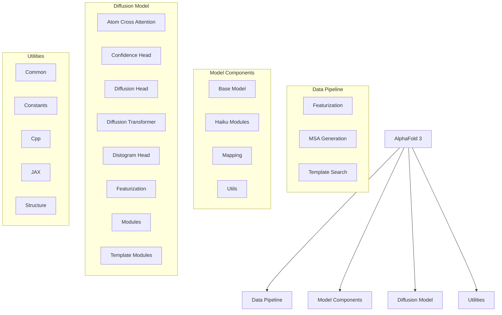

```mermaid
flowchart TD
    A[AlphaFold 3]
    B[Data Pipeline]
    C[Model Components]
    D[Diffusion Model]
    E[Utilities]

    A --> B
    A --> C
    A --> D
    A --> E

    subgraph Data Pipeline
        B1[Featurization]
        B2[MSA Generation]
        B3[Template Search]
    end

    subgraph Model Components
        C1[Base Model]
        C2[Haiku Modules]
        C3[Mapping]
        C4[Utils]
    end

    subgraph Diffusion Model
        D1[Atom Cross Attention]
        D2[Confidence Head]
        D3[Diffusion Head]
        D4[Diffusion Transformer]
        D5[Distogram Head]
        D6[Featurization]
        D7[Modules]
        D8[Template Modules]
    end

    subgraph Utilities
        E1[Common]
        E2[Constants]
        E3[Cpp]
        E4[JAX]
        E5[Structure]
    end
```